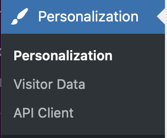

# API Client

Sunbreak can be used outside of blocks. We want developers to use our API to build awesome features for their websites. 
To enable this, we’ve created an API Client. It shows how to call the various methods, endpoints, etc. 

You can try it live on your own WordPress website. The API Client can be found in the WordPress admin menu. Go to Personalization -> API Client.

 
 

 
 
 
