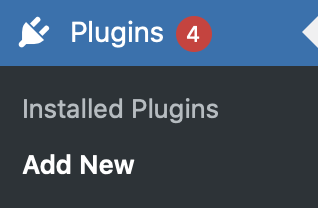
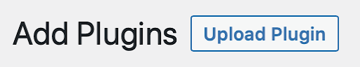
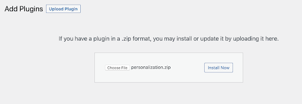

# Install Sunbreak Personalization

Before you install contact Sunbreak. We will provide you with a plugin. Ensure you download it to a location ready for installation.

## How to install Sunbreak

Installing Sunbreak Personalization is easy, follow these steps.

1. From the WordPress admin dashboard, select Plugins -> Add New.

2. Click on the “Upload Plugin” in the top left corner.

3. Select the Personalization.zip file from where you downloaded it.

4. Click on the “Install Now” button.
5. After the plugin is installed, click on the “Activate Plugin” button.

# Creating a Sunbreak account

Sunbreak Personalization is a SaaS solution. This means that you need to create an account to connect to the Sunbreak servers. This is easy to do.

## Database Location

By default, there are two options for database location, Development or Production. There is an additional “Use custom server” checkbox - this is for production use. When you are ready to go live Sunbreak will provide you with a custom URL. For evaluation, select Production.

1. From the WordPress admin menu, select Personalization.
1. You will see a login / sign-up dialog box. If this is the first time you are installing, select the sign-up tab.
1. Fill in the form and click connect.
1. That’s it, you’re ready to go!
